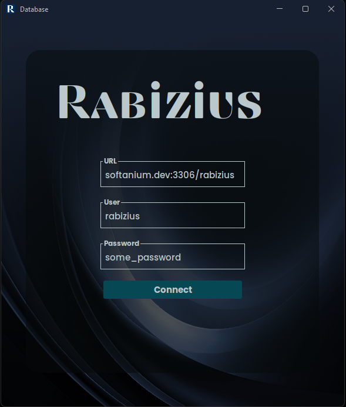
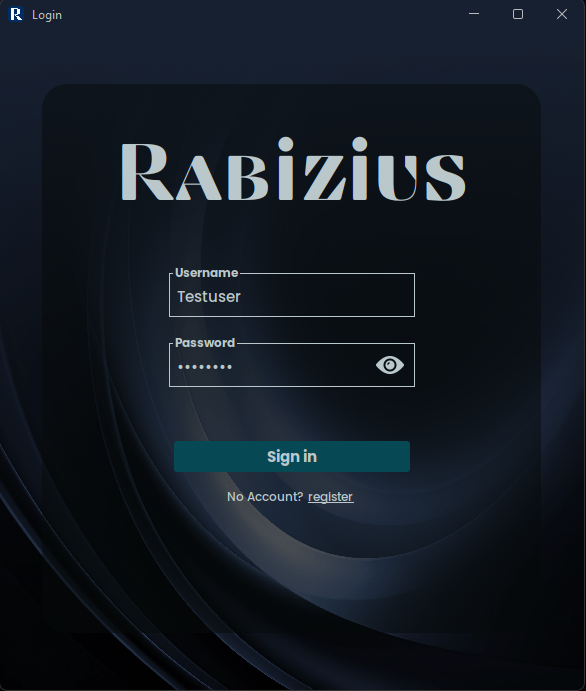
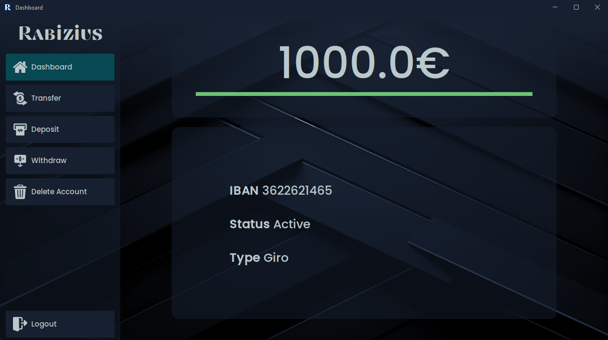

# Rabizius Banking Software

Small School Project by TGI-1 Class of 2023/24 at Erich-Hauser-Gewerbeschule

## Info
- **Project Status:** Work-in-progress (on-hold)
- **Language:** Java
- **Database Library:** MariaDB Java Client
- **Look & Feel Library:** FlatLaf

## TGI-1 2023/24

- Sebi
- Linus
- Torben
- Niels
- Fabrizio
- Silas
- Laurin
- Max
- Jonas
- Leander
- Vinzent
- Lukas
- Adonis
- Uwe
- Pascal
- Ionatan
- Seba
- Leon
- Adis
- Kilian

# How to Use

1. **Set Up the Database**  
   - Create a database that you can connect to.  
   - Run the `rabizius.sql` query in the database to set it up.

2. **Launch the Software**  
   - Ensure you have **JVM 21** installed.  
   - Open the software and enter your database credentials to connect.

# Software Screenshots

### Database Setup  

### Login Screen  

### Dashboard View  
